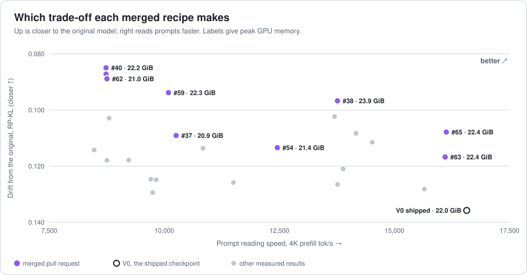
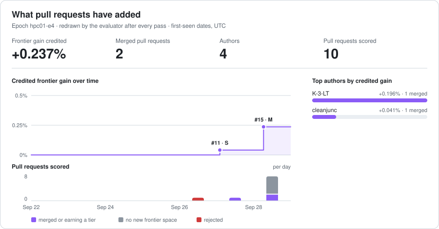

# BitTrellis score records (hpc01-e5)

> Every evaluated pull request, the frontier it was ranked against, and the artifacts behind both.

## Which checkpoint to use

Every merged recipe trades a little of one thing for another. Pick by what you need; each change is against today's shipped checkpoint (V0).



| Best for | Recipe | Closeness to the original (RP-KL) | Prompt reading, 4K | Peak GPU memory |
|---|---|---|---|---|
| **Closest to the original model** | `nvfp4-blockfit-gdn-fp8-qkv-attn-q4k-lmhead-q4k`<br>#93 by @kaivexa  | **0.0743 · 45.3% closer** | 13,540 tok/s · 18% slower | 22.68 GiB · 0.66 GiB more |
| **Fastest prompt reading** | `nvfp4-blockfit-all-lmhead-q4k`<br>#28 by @cleanjunc  | 0.0992 · 26.9% closer | **16,998 tok/s · 3% faster** | 22.02 GiB · 0.00 GiB less |
| **Least GPU memory** | `q4k-qkv-attn-mlp-nvfp4-blockfit-zo-lmhead`<br>#87 by @cleanjunc  | 0.0899 · 33.7% closer | 8,710 tok/s · 47% slower | **20.56 GiB · 1.45 GiB less** |
| *for reference* | V0, today's shipped checkpoint | 0.1357 | 16,571 tok/s | 22.02 GiB |

Build one yourself (after `scripts/setup_models.sh` in [bittrellis](https://github.com/coderbench/bittrellis)):

```bash
bittrellis build manifests/nvfp4-blockfit-gdn-fp8-qkv-attn-q4k-lmhead-q4k.yaml --out models/nvfp4-blockfit-gdn-fp8-qkv-attn-q4k-lmhead-q4k
bittrellis build manifests/nvfp4-blockfit-all-lmhead-q4k.yaml --out models/nvfp4-blockfit-all-lmhead-q4k
bittrellis build manifests/q4k-qkv-attn-mlp-nvfp4-blockfit-zo-lmhead.yaml --out models/q4k-qkv-attn-mlp-nvfp4-blockfit-zo-lmhead
```

## Progress



## Every measured result

Written by the evaluator after each pass. Re-derive any score yourself:

```bash
bittrellis frontier hpc01-e5/accepted <your artifact>
```

| | Checkpoint | RP-KL ↓ | tasks ↑ | decode tok/s ↑ | prefill 4K tok/s ↑ | peak GPU GiB ↓ | holdout | FG-2 |
|---|---|---:|---:|---:|---:|---:|---|---:|
| ★ | nvfp4-blockfit-gdn-fp8-qkv-attn-q4k-lmhead-q4k | 0.0743 | 570/784 | 89.3 | 13,540 | 22.68 | PASS | 0.004% |
| ★ | gdn-fp8-state-blockfit | 0.0760 | 572/784 | 86.8 | 14,682 | 23.39 | PASS | 0.003% |
| ★ | nvfp4-blockfit-gdn-fp8-qkv-attn-q4k-mlp-q4k-1-23-48-63-lmhead-q4k | 0.0763 | 577/784 | 89.7 | 9,975 | 21.99 | PASS | 0.009% |
|   | nvfp4-blockfit-gdn-fp8-qkv-lmhead-q4k | 0.0782 | 575/784 | 89.5 | 14,151 | 22.84 | PASS | 0.000% |
| ★ | nvfp4-blockfit-gdn-fp8-qkv12-51-attn-q4k-lmhead-q4k | 0.0796 | 563/784 | 91.5 | 14,112 | 22.38 | PASS | 0.008% |
| ★ | nvfp4-blockfit-gdn-fp8-qkv16-47-zo24-35-lmhead-q4k | 0.0849 | 573/784 | 91.3 | 15,061 | 22.65 | PASS | 0.001% |
|   | gdn-fp8-mlp-q4k-zo-deep-q4k | 0.0850 | 568/784 | 87.1 | 8,735 | 22.16 | PASS | 0.000% |
|   | gdn-fp8-mlp-q4k-skip0 | 0.0853 | 566/784 | 84.2 | 8,715 | 22.82 | PASS | 0.000% |
| ★ | nvfp4-blockfit-gdn-qkv-attn-q4k-lmhead-q4k | 0.0858 | 569/784 | 95.1 | 13,627 | 21.67 | PASS | 0.013% |
|   | gdn-fp8-qkv-z-out-q4k-mlp-q4k | 0.0872 | 573/784 | 88.6 | 8,735 | 21.85 | PASS | 0.000% |
|   | gdn-q4k-fp8-mid24-35-mlp-q4k | 0.0889 | 568/784 | 93.9 | 8,754 | 20.98 | PASS | 0.000% |
|   | gdn-fp8-unsloth-mlp0-27-q4k-mlp46-63-lmhead | 0.0892 | 572/784 | 84.1 | 11,869 | 23.61 | PASS | 0.000% |
| ★ | nvfp4-blockfit-gdn-fp8-mid24-35-lmhead-q4k | 0.0896 | 575/784 | 93.4 | 16,280 | 22.39 | PASS | 0.010% |
| ★ | q4k-qkv-attn-mlp-nvfp4-blockfit-zo-lmhead | 0.0899 | 565/784 | 95.2 | 8,710 | 20.56 | PASS | 0.013% |
| ★ | nvfp4-blockfit-attn-q4k-lmhead-q4k | 0.0909 | 563/784 | 95.6 | 15,555 | 21.85 | PASS | 0.005% |
| ★ | gdn-attn-q4k-early3-mid28-blockfit-rest-lmhead | 0.0921 | 572/784 | 95.9 | 12,186 | 21.36 | PASS | 0.003% |
|   | gdn-fp8-qkv-out-q4k-mlp-early8-mid55 | 0.0938 | 570/784 | 88.5 | 10,091 | 22.25 | PASS | 0.000% |
| ★ | gdn-q4k-mlp-early8-mid24-skip0-attn-blockfit-rest-lmhead | 0.0946 | 566/784 | 96.1 | 10,591 | 21.08 | PASS | 0.002% |
|   | gdn-fp8-lmhead-q4k | 0.0967 | 576/784 | 84.0 | 13,763 | 23.93 | PASS | 0.000% |
| ★ | nvfp4-blockfit-all-lmhead-q4k | 0.0992 | 567/784 | 95.7 | 16,998 | 22.02 | PASS | 0.052% |
| ★ | gdn-q4k-skip0-nvfp4-blockfit-rest-lmhead-q4k | 0.1015 | 578/784 | 96.0 | 14,072 | 21.64 | PASS | 0.000% |
|   | V3-gdn-fp8 | 0.1024 | 573/784 | 84.0 | 13,701 | 23.93 | PASS | 0.000% |
| ★ | gdn-mlp-q4k-skip-layer0 | 0.1029 | 564/784 | 96.4 | 8,801 | 20.54 | PASS | 0.000% |
|   | gdn-q4k-fp8-mid24-35-unsloth-mlp0-27-lmhead | 0.1031 | 574/784 | 93.6 | 14,036 | 22.08 | PASS | 0.000% |
|   | gdn-fp8-mid24-35-unsloth-mlp0-27-lmhead | 0.1078 | 575/784 | 93.3 | 16,128 | 22.39 | PASS | 0.000% |
|   | gdn-fp8-qkv-all-zo-split | 0.1083 | 568/784 | 88.5 | 14,165 | 23.02 | PASS | 0.000% |
| ★ | gdn-attn-q4k-mlp-early8-mid24-skip0 | 0.1091 | 572/784 | 96.2 | 10,258 | 20.92 | PASS | 0.001% |
|   | gdn-state-fp8-skip0 | 0.1115 | 573/784 | 86.8 | 14,520 | 23.39 | PASS | 0.000% |
|   | gdn-attn-q4k-mlp-early3-mid28-skip0 | 0.1134 | 560/784 | 96.1 | 12,456 | 21.36 | PASS | 0.000% |
|   | gdn-attn-q4k-mlp-mid | 0.1136 | 566/784 | 96.2 | 10,842 | 21.06 | PASS | 0.000% |
|   | V1-all-q4k | 0.1142 | 575/784 | 96.4 | 8,477 | 20.37 | PASS | 0.000% |
|   | gdn-fp8-mid24-35-lmhead-q4k | 0.1167 | 567/784 | 93.3 | 16,103 | 22.39 | PASS | 0.000% |
| ★ | gdn-zo-deep-mlp-skip0 | 0.1178 | 563/784 | 96.3 | 9,228 | 20.81 | PASS | 0.000% |
| ★ | V9-gdn-q4k-mlp-q4k | 0.1179 | 562/784 | 96.5 | 8,754 | 20.41 | — | 0.000% |
|   | gdn-q4k-skip-layer0 | 0.1210 | 572/784 | 96.0 | 13,887 | 21.64 | PASS | 0.000% |
|   | gdn-q4k-deep | 0.1238 | 578/784 | 95.9 | 15,137 | 21.83 | FAIL | 0.000% |
| | ↳ *not credited: private holdout FAIL* | | | | | | | |
|   | V7-mlp-q4k-early | 0.1247 | 561/784 | 96.1 | 9,707 | 21.40 | — | 0.000% |
|   | mlp-q4k-skip-layer0 | 0.1249 | 563/784 | 96.5 | 9,826 | 20.91 | PASS | 0.000% |
|   | V13-mlp-unsloth-bytes | 0.1258 | 566/784 | 95.7 | 16,649 | 22.02 | FAIL | 0.000% |
| | ↳ *not credited: private holdout FAIL* | | | | | | | |
|   | gdn-mlp-deep-q4k | 0.1258 | 567/784 | 96.2 | 11,502 | 21.26 | PASS | 0.000% |
|   | V4-gdn-q4k | 0.1265 | 566/784 | 96.0 | 13,766 | 21.58 | PASS | 0.000% |
|   | V5-attn-q4k | 0.1282 | 556/784 | 95.5 | 15,653 | 21.85 | — | 0.000% |
|   | V6-mlp-q4k | 0.1294 | 563/784 | 96.6 | 9,748 | 20.84 | PASS | 0.000% |
|   | V0-baseline-rebuild | 0.1357 | 564/784 | 95.6 | 16,571 | 22.02 | — | 0.000% |

Epoch `hpc01-e5` · rules: [bittrellis](https://github.com/coderbench/bittrellis) ([specification](https://github.com/coderbench/bittrellis/blob/main/docs/specification.md)).

`results/` holds one record per evaluated pull-request head -- never rewritten, with any re-measurement published beside it as `.remeasured-N` -- `observations/` the first-seen record that decides who submitted a recipe first, and `accepted/` the artifacts of merged results. The private holdout never appears here: records carry PASS or FAIL only.
