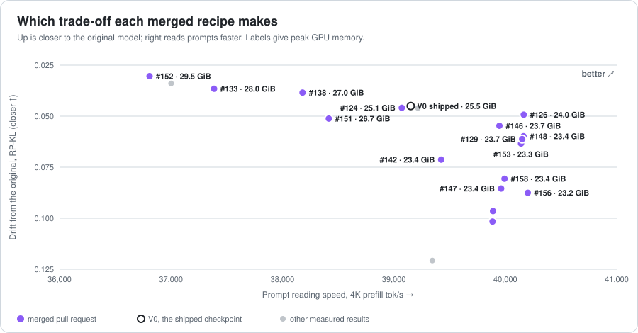
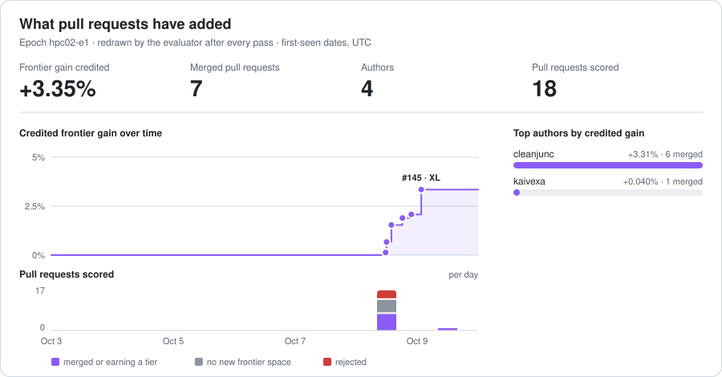

# BitTrellis score records (hpc02-e1)

> Every evaluated pull request, the frontier it was ranked against, and the artifacts behind both.

## Which checkpoint to use

Every merged recipe trades a little of one thing for another. Pick by what you need; each change is against today's shipped checkpoint (V0).



| Best for | Recipe | Closeness to the original (RP-KL) | Prompt reading, 4K | Peak GPU memory |
|---|---|---|---|---|
| **Closest to the original model** | `ud-lmhead-q4k-embed-q4k`<br>#124 by @cleanjunc  | **0.0459 · 1.9% further** | 39,071 tok/s · 0% slower | 25.12 GiB · 0.39 GiB less |
| **Fastest prompt reading** | `ud-downs-q4k-lmhead-embed-q4k`<br>#126 by @cleanjunc  | 0.0493 · 9.4% further | **40,165 tok/s · 3% faster** | 23.96 GiB · 1.54 GiB less |
| **Least GPU memory** | `pr129-recurrent-zo-q4k`<br>#130 by @cleanjunc  | 0.0965 · 114.2% further | 39,890 tok/s · 2% faster | **23.50 GiB · 2.01 GiB less** |
| *for reference* | V0, today's shipped checkpoint | 0.0450 | 39,151 tok/s | 25.51 GiB |

Build one yourself (after `scripts/setup_models.sh` in [bittrellis](https://github.com/coderbench/bittrellis)):

```bash
bittrellis build manifests/ud-lmhead-q4k-embed-q4k.yaml --out models/ud-lmhead-q4k-embed-q4k
bittrellis build manifests/ud-downs-q4k-lmhead-embed-q4k.yaml --out models/ud-downs-q4k-lmhead-embed-q4k
bittrellis build manifests/pr129-recurrent-zo-q4k.yaml --out models/pr129-recurrent-zo-q4k
```

## Progress



## Every measured result

Written by the evaluator after each pass. Re-derive any score yourself:

```bash
bittrellis --track HPC-02 frontier hpc02-e1/accepted <your artifact>
```

| | Checkpoint | RP-KL ↓ | tasks ↑ | decode tok/s ↑ | prefill 4K tok/s ↑ | peak GPU GiB ↓ | holdout | FG-2 |
|---|---|---:|---:|---:|---:|---:|---|---:|
| ★ | V3-exps-q5k-down-q6k | 0.0340 | 564/784 | 383.6 | 37,001 | 29.24 | PASS | 0.368% |
|   | V0-unsloth-ud | 0.0450 | 570/784 | 398.5 | 39,151 | 25.51 | — | 0.000% |
| ★ | ud-lmhead-q4k-embed-q4k | 0.0459 | 566/784 | 398.9 | 39,071 | 25.12 | PASS | 0.002% |
|   | V1-kq-rtn-udmap | 0.0460 | 563/784 | 398.9 | 39,216 | 25.51 | PASS | 0.000% |
| ★ | ud-downs-q4k-lmhead-embed-q4k | 0.0493 | 570/784 | 404.4 | 40,165 | 23.96 | PASS | 0.078% |
| ★ | ud-downs-q4k-gdn-qkv-q4k-lmhead-embed-q4k | 0.0612 | 565/784 | 432.1 | 40,151 | 23.73 | PASS | 0.493% |
| ★ | pr129-recurrent-zo-q4k | 0.0965 | 570/784 | 458.7 | 39,890 | 23.50 | PASS | 0.317% |
| ★ | V2-all-q4k | 0.1207 | 573/784 | 457.9 | 39,346 | 23.25 | PASS | 0.222% |

Epoch `hpc02-e1` · rules: [bittrellis](https://github.com/coderbench/bittrellis) ([specification](https://github.com/coderbench/bittrellis/blob/main/docs/specification.md)).

`results/` holds one record per evaluated pull-request head -- never rewritten, with any re-measurement published beside it as `.remeasured-N` -- `observations/` the first-seen record that decides who submitted a recipe first, and `accepted/` the artifacts of merged results. The private holdout never appears here: records carry PASS or FAIL only.
